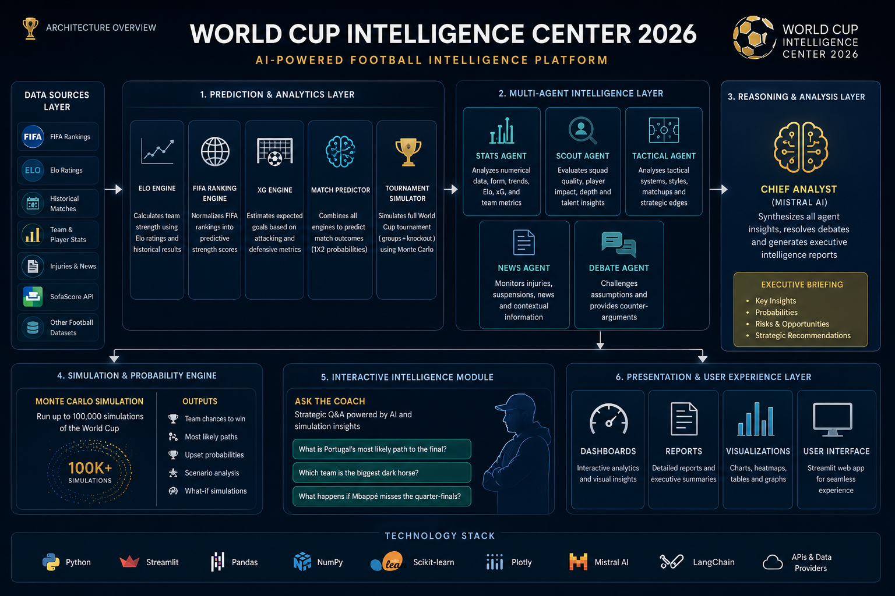

# 🏆 World Cup Intelligence Center 2026



An AI-powered football intelligence platform that combines predictive analytics, tournament simulation, multi-agent reasoning, and LLM-driven strategic analysis to generate actionable insights for FIFA World Cup scenarios.

---

## 📖 Overview

**World Cup Intelligence Center 2026** is an end-to-end football analytics platform designed to simulate, analyze, and explain World Cup outcomes using advanced AI and data-driven methodologies.

The platform integrates:

* 📊 Predictive Analytics
* ⚽ Elo Ratings
* 🌍 FIFA Rankings
* 📈 Historical Performance Data
* 🤖 Multi-Agent AI Architecture
* 🧠 Mistral AI Reasoning
* 🎲 Tournament Simulation Engine
* 🎯 Strategic Coaching Analysis

The goal is to provide executive-level football intelligence similar to the analytical capabilities used by modern sports organizations and performance departments.

---

## 🚀 Key Features

### ⚽ Match Predictor

Predicts the outcome of any international football match using multiple performance indicators.

#### Inputs

* Elo Ratings
* FIFA Rankings
* Team Strength Metrics
* Historical Performance Data
* Expected Goals (xG) Indicators

#### Outputs

* Home Win Probability
* Draw Probability
* Away Win Probability

---

### 🏆 Tournament Intelligence

Simulates the complete FIFA World Cup tournament structure from group stages to the final.

#### Features

* Group Stage Simulation
* Knockout Stage Progression
* Qualification Probability Analysis
* Tournament Forecasting

---

### 🤖 Multi-Agent Intelligence Center

The platform leverages specialized AI agents, each focused on a specific analytical domain.

#### 📊 Stats Agent

Analyzes:

* Elo Ratings
* FIFA Rankings
* Team Form
* Expected Goals Metrics

#### 🔍 Scout Agent

Analyzes:

* Team Strengths
* Squad Depth
* Key Player Impact

#### 🎯 Tactical Agent

Analyzes:

* Tactical Matchups
* Playing Styles
* Strategic Advantages and Weaknesses

#### 📰 News Agent

Analyzes:

* Injuries
* Suspensions
* Recent Team Developments

#### ⚖️ Debate Agent

Challenges assumptions, evaluates alternative scenarios, and identifies potential blind spots in predictions.

#### 🧠 Chief Analyst

Powered by **Mistral AI**.

Generates:

* Executive Briefings
* Match Intelligence Reports
* Strategic Recommendations

---

### 🎙️ Ask the Coach

Interactive football reasoning module powered by AI.

#### Example Questions

* What is Portugal's most likely path to the final?
* Which team is the biggest dark horse of the tournament?
* What happens if Mbappé misses the quarter-finals?
* How would Portugal perform without Cristiano Ronaldo?

---

### 🎲 Monte Carlo Simulation Engine

Runs large-scale tournament simulations to estimate probabilities and forecast outcomes.

#### Example Results

| Team     | Chance to Win |
| -------- | ------------- |
| France   | 18.4%         |
| Portugal | 16.7%         |
| Brazil   | 15.2%         |

---

## 🏗️ Architecture

### Prediction Layer

* Elo Rating Engine
* FIFA Ranking Engine
* Expected Goals (xG) Projection Engine

### Multi-Agent Layer

* Stats Agent
* Scout Agent
* Tactical Agent
* News Agent
* Debate Agent

### Reasoning Layer

* Mistral AI Chief Analyst

### Presentation Layer

* Streamlit User Interface
* Executive Dashboards
* Strategic Reports

---

## 🛠️ Technology Stack

### Frontend

* Streamlit

### Artificial Intelligence

* Mistral AI
* Multi-Agent Architecture

### Data Sources

* FIFA Rankings
* Elo Ratings
* Historical Match Results
* Team Intelligence Datasets

### Analytics & Machine Learning

* Pandas
* NumPy
* Scikit-Learn

---

## ⚙️ Installation

### Clone the Repository

```bash
git clone https://github.com/yourusername/world-cup-intelligence-center.git
cd world-cup-intelligence-center
```

### Install Dependencies

```bash
pip install -r requirements.txt
```

### Configure Environment Variables

```bash
export MISTRAL_API_KEY="your_api_key"
export MISTRAL_MODEL="mistral-medium-latest"
```

### Run the Application

```bash
streamlit run app.py
```

---

## 🔮 Future Roadmap

### Phase 7 — Production Readiness

* Docker Deployment
* CI/CD Pipelines
* Monitoring & Observability
* Automated Data Refresh

### Phase 8 — Live Data Integration

* Real-Time Match Events
* Injury Monitoring
* Squad Updates
* Dynamic Tournament Forecasting

### Phase 9 — Agentic Football Operations Center

* Autonomous Scouting Agents
* Continuous Tournament Monitoring
* Automated Briefing Generation
* Advanced Strategic Decision Support

---

## 👨‍💻 Author

**Gonçalo Pedro**
*AI Tech Lead*

Building AI-powered decision systems, multi-agent platforms, and intelligent analytics solutions.
